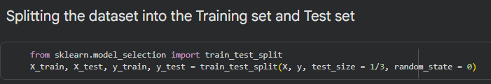

## O intuito da criação do blog:

Neste blog, abordarei alguns temas que venho estudando. Atualmente, meu foco está em Machine Learning.
Por enquanto, vou apenas transcrever algumas anotações sobre pré-processamento de dados.
 
 
 
No momento de dividir o conjunto de dados em conjunto de treinamento
e conjunto de teste. O recomendado é seguir o padrão abaixo:

* 80% - Observações de treinamento
* 20% - Observações de Teste

Um exemplo de como ficaria no código:

* X, y: Seus dados (características e alvo).
* test_size=0.2: Define que 20% dos dados serão guardados para teste.

 
## Pré-Processamento
### O que é Feature Scaling?

É uma etapa essencial do pré-processamento que visa colocar todas as variáveis 
(características) numa escala comum. Sem isto, algoritmos que utilizam cálculos 
de distância (como a Distância Euclidiana) podem dar uma importância desproporcional 
a variáveis com números maiores, prejudicando a precisão do modelo.
> Aqui estou usando um resumo simples feito por uma LLM (Gemini).

 
## Standardisation (Padronização)

Essa técnica transforma os dados para que tenham uma média de 0 e um desvio padrão de 1.
É a escolha "padrão", quando os dados seguem uma distribuição normal ou contêm outliers
(valores muito fora da curva), pois não comprime os dados num intervalo fixo.

Fórmula: 
$$z = \frac{x - \mu}{\sigma}$$
 
 

## Normalisation (Normalização / Min-Max Scaling)

Já essa técnica subtrai o valor mínimo da coluna e divide pela amplitude (max -min).
Todos os valores ficarão comprimidos obrigatoriamente entre 0 e 1.

Fórmula:
$$x' = \frac{x - \text{min}(x)}{\text{max}(x) - \text{min}(x)}$$

 

## O que é Overfitting?

É basicamente a situação em que um modelo de Machine Learning aprende apenas em um
conjunto de dados e não pode se adaptar a nenhum outro.

 
> Uma anotação "aleatória", mas acho importante destacar aqui. Em alguns conjuntos de em arquivos .CSV, é comum o uso de ';' para não confundir com vírgula decimal. Para esse caso usamos o delimitador (sep=';').

